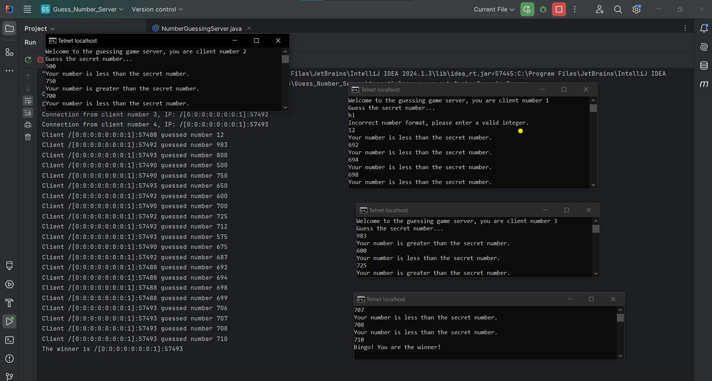

# Number Guessing Game Server

A simple multi-client server application where clients attempt to guess a secret number. The server generates a random number between 0 and 1000, and clients connect to the server and try to guess it. The server provides feedback on whether the guess is too high, too low, or correct. The game ends when a client guesses the number correctly.

## Features
- Multi-threaded server that handles multiple clients simultaneously.
- Random secret number generation.
- Clients receive feedback on each guess.
- Notifies when the game is over and declares the winner.
- Input validation to handle incorrect number formats.

## How it Works

1. The server starts and waits for clients to connect.
2. Each client receives a unique number and is asked to guess the secret number.
3. The server provides feedback based on the client's guess:
   - If the guess is too high, the server replies: "Your number is greater than the secret number."
   - If the guess is too low, the server replies: "Your number is less than the secret number."
   - If the guess is correct, the client wins, and the server declares the winner.
4. Once the game ends, new clients are notified of the winner.
5. If a client provides an invalid input, such as non-numeric characters, the server will notify them with a message like "Incorrect number format."




## Project Structure

```bash
.
├── src
│   └── com
│       └── ayb
│           └── NumberGuessingServer.java
├── README.md
└── illustration.png  # Image illustrating the process flow (see below)
